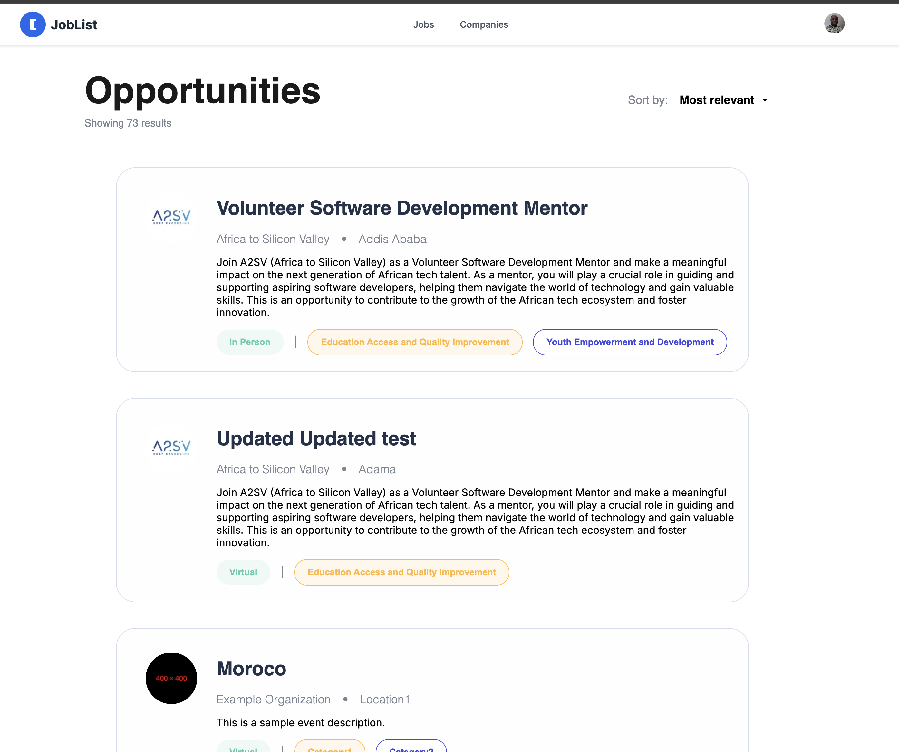

# Job Listing Application

A modern job listing platform built with Next.js, TypeScript, and Tailwind CSS. This application provides a clean and efficient interface for browsing and managing job listings.

## 🚀 Features

- Modern UI with Tailwind CSS
- Type-safe development with TypeScript
- Responsive design
- Fast and optimized performance with Next.js

## 📸 Screenshots

### Jobs Listing Page

The main jobs listing page displays available positions with key information such as job title, company, location, and salary range. Users can easily browse through multiple job listings and filter their search based on preferences.

### Job Details Page

The job details page provides comprehensive information about a specific position, including detailed job description, requirements, company information, and application instructions. This page helps candidates make informed decisions about job applications.

## 🛠️ Tech Stack

- **Framework:** [Next.js](https://nextjs.org/) 15.3.0
- **Language:** [TypeScript](https://www.typescriptlang.org/) 5.8.3
- **Styling:** [Tailwind CSS](https://tailwindcss.com/) 4.1.4
- **CSS Preprocessor:** [Sass](https://sass-lang.com/) 1.86.3
- **Package Manager:** npm

## 📋 Prerequisites

- Node.js (v18 or later recommended)
- npm (v9 or later recommended)

## 🚀 Getting Started

1. Clone the repository:
   ```bash
   git clone <repository-url>
   cd job-listing
   ```

2. Install dependencies:
   ```bash
   npm install
   ```

3. Run the development server:
   ```bash
   npm run dev
   ```

4. Open [http://localhost:3000](http://localhost:3000) in your browser to see the application.

## 📦 Available Scripts

- `npm run dev` - Starts the development server
- `npm run build` - Builds the application for production
- `npm run start` - Starts the production server
- `npm run lint` - Runs ESLint to check code quality

## 🏗️ Project Structure

```
job-listing/
├── app/              # Next.js app directory
├── public/           # Static assets
├── node_modules/     # Dependencies
├── .next/            # Next.js build output
├── package.json      # Project dependencies and scripts
├── tailwind.config.js # Tailwind CSS configuration
├── postcss.config.js # PostCSS configuration
├── tsconfig.json     # TypeScript configuration
└── next.config.js    # Next.js configuration
```

## 🔧 Configuration

- Tailwind CSS is configured in `tailwind.config.js`
- TypeScript settings are in `tsconfig.json`
- Next.js configuration is in `next.config.js`

## 📝 License

This project is licensed under the MIT License - see the LICENSE file for details.

## 🤝 Contributing

Contributions are welcome! Please feel free to submit a Pull Request.
